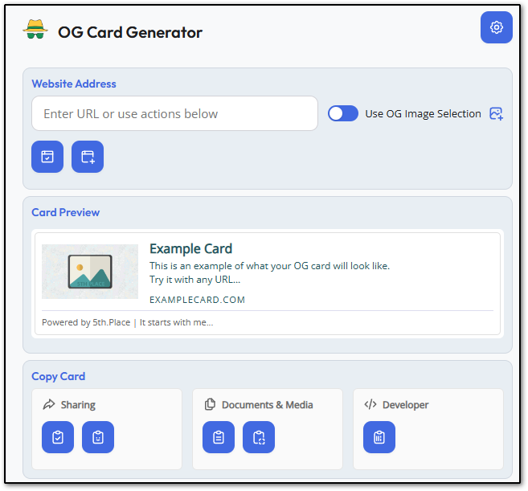
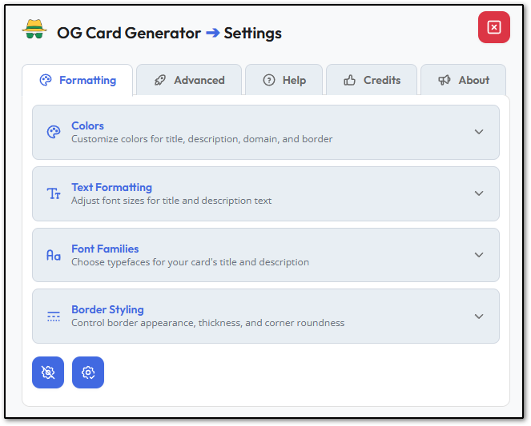

  
  <h1>OG Card Generator</h1>
  
<em>A Chrome extension that fetches Open Graph metadata from websites and transforms it into beautifully formatted preview cards for email sharing. Works with all Chromium-based browsers.</em>

---

## ✨ Features

### 🎨 **Extensive Customization**
- **Color Schemes**: Customize colors for title, description, domain, and borders with built-in color picker
- **Typography**: Adjust font sizes for title and description text
- **Font Families**: Choose from Google Fonts (Outfit, Open Sans, Roboto, Inter, Poppins, Montserrat) and system fonts
- **Border Styling**: Control border style (solid, dotted, dashed), weight, and corner roundness
- **Image Sizing**: Flexible image dimensions with predefined presets

### 🤖 **Intelligent Image Selection**
- Smart image selection with sophisticated scoring algorithm that evaluates:
  - Image quality and dimensions
  - Relevance to content
  - Optimal aspect ratios
- Automatic fallback to default thumbnails when needed
- Toggle between OG metadata images and smart selection

### 🎨 **Favicon Brand Cards**
- Universal brand cards using site favicons with automatic color detection
- Intelligent edge-based color sampling for accurate brand colors
- Independent border rendering for full-size and thumbnail images
- Session-based toggle state management
- Works with any website via Google's favicon API

### 💾 **Card Management**
- Card history persistence with metadata tracking
- Freshness indicator system (5-level battery-style display)
- Maximum card limit management
- Quick access to recent cards

### 🎯 **Advanced Settings**
- Configurable fetch timeout
- Maximum title/description length controls
- Debug mode for developers
- Fallback image customization
- Font pairing system with curated combinations

### 🎨 **Color Scheme Management**
- Save up to 5 custom color schemes
- Preset color combinations
- Quick scheme switching
- Visual scheme previews

## 🚀 Installation

### From Chrome Web Store
1. Visit the Chrome Web Store (link coming soon)
2. Click "Add to Chrome"
3. Click "Add Extension" in the popup

### Manual Installation (Developer Mode)

**Option 1: Download Packed Extension (Recommended)**
1. Download `og-card-generator-v3.3.0.zip` from the [Releases](https://github.com/mandalaReopens/og-card-generator/releases) page
2. Extract the zip file to a folder on your computer
3. Open Chrome and navigate to `chrome://extensions/`
4. Enable "Developer mode" in the top right
5. Click "Load unpacked"
6. Select the extracted extension folder

**Option 2: Clone Repository**
1. Clone this repository: `git clone https://github.com/mandalaReopens/og-card-generator.git`
2. Open Chrome and navigate to `chrome://extensions/`
3. Enable "Developer mode" in the top right
4. Click "Load unpacked"
5. Select the cloned extension directory

## 📖 How to Use

1. **Generate a Card**: Enter a URL, toggle Smart Select/Brand Cards if desired, then use the "current tab" button or generate
2. **Preview**: View the generated card with fetched metadata
3. **Customize**: Adjust appearance in Formatting settings
4. **Copy**: Copy as formatted HTML or raw code for email sharing
5. **Manage History**: Access recently generated cards from history

## 🎨 Settings Pages

### Formatting
- Colors customization
- Text formatting (font sizes)
- Font families selection
- Border styling options

### Advanced
- Image sizing and dimensions
- Fetch timeout configuration
- Session timeout configuration
- Text length limits
- Debug mode
- Fallback image settings
- Font pairing management

### Help
- Features overview
- Step-by-step usage guide

### Credits
- Open source libraries acknowledgment
- AI development assistance attribution

### About
- Extension information
- Version details
- Creator attribution

## 🏗️ Technical Stack

- **Manifest V3** Chrome Extension API
- **Coloris** - Elegant JavaScript color picker ([MIT License](https://github.com/mdbassit/Coloris))
- **Tabler Icons** - 5500+ free SVG icons ([MIT License](https://github.com/tabler/tabler-icons))
- Vanilla JavaScript (no frameworks)
- CSS Grid & Flexbox layouts
- Chrome Storage API for persistence

## 📸 Screenshots

### Main Interface
The main card generation interface with URL input, preview, and copy options.

### Settings Page
Comprehensive formatting controls including colors, fonts, borders, and advanced options.

## 🎯 Version

**Current Version**: 3.3.0

### What's New in 3.3.0
- 🎨 **Favicon Brand Cards** - Universal brand cards using site favicons with automatic color detection
- 🔄 **Session-based Toggle Persistence** - Smart Select and Brand Cards state management with configurable timeout
- 🎯 **Improved Color Sampling** - Edge-based histogram algorithm for accurate brand color detection
- 🖼️ **Independent Border Rendering** - Separate border systems for full-size and thumbnail images
- ✨ **Two-Color Gradient Spinner** - Visual feedback with OG green/yellow gradient animation
- 🐛 **Bug Fixes** - Keyword filter, toggle state persistence, and color quantization improvements

## 🙏 Credits

### Created By
**5th Place** - It starts with me...

### Open Source Libraries
- [Coloris](https://coloris.js.org/) by Adam Lui - Color picker component
- [Tabler Icons](https://tabler.io/icons) - Icon library

### Development Assistance
Developed with assistance from [Claude AI](https://claude.ai) by Anthropic for code generation, debugging, and design decisions.

## 📄 License

Copyright © 2025 5th Place. All rights reserved.

## 🐛 Issues & Feedback

Found a bug or have a feature request? Please open an issue on the [GitHub repository](https://github.com/mandalaReopens/og-card-generator).

## 🔗 Links

- **GitHub Repository**: https://github.com/mandalaReopens/og-card-generator
- **Chrome Web Store**: Coming soon

---

*OG Card Generator makes your shared links stand out with polished, professional-looking cards for emails and messages.*
